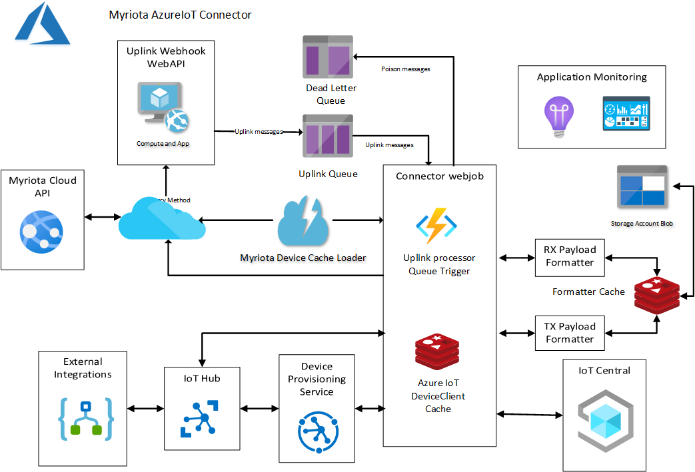

# Myriota Azure IoT Identity Translation Gateway

An Azure IoT Cloud Identity Translation gateway for the [Myriota](https://myriota.com/) Satellite IoT service with [Azure IoT Hub](https://azure.microsoft.com/en-us/products/iot-hub/?WT.mc_id=IoT-MVP-5001375), [Azure IoT Central](https://azure.microsoft.com/en-us/products/iot-central/?WT.mc_id=IoT-MVP-5001375), [Azure IoT Hub Device Provisoning Service](https://learn.microsoft.com/en-us/azure/iot-dps/about-iot-dps?WT.mc_id=IoT-MVP-5001375) and uplink messaging.

The repo has the source code for the series of blog posts written as I built the connector

1. [Device Configuration](http://blog.devmobile.co.nz/2023/08/25/myriota-device-configuration/)
2. [Uplink Serialisation](http://blog.devmobile.co.nz/2023/09/08/myriota-device-uplink-serialisation/)
3. [Uplink Payload Formatters and caching](http://blog.devmobile.co.nz/2023/09/10/myriota-uplink-payload-formatters-and-caching/)
4. [Azure IoT Hub Connectivity](http://blog.devmobile.co.nz/2023/09/27/myriota-connector-azure-iot-hub-connectivity/)
5. [DTDLV2 Support](http://blog.devmobile.co.nz/2023/09/30/myriota-connector-azure-iot-hub-dtdl-support/)
6. [Uplink Payload Formatters revisited](http://blog.devmobile.co.nz/2023/10/05/myriota-uplink-payload-formatters-revisited/)
7. [Uplink Payload Formatters Test Harness](http://blog.devmobile.co.nz/2023/10/07/myriota-uplink-payload-formatters-test-harness/)
8. [Payload formatters revisited again](http://blog.devmobile.co.nz/2023/10/29/myriota-connector-payload-formatters-revisited-again/)
9. [Azure IoT Hub downlink refactoring](http://blog.devmobile.co.nz/2023/11/03/myriota-connector-azure-iot-hub-downlink-refactoring/)
10. [Uplink message processor output binding](http://blog.devmobile.co.nz/2023/11/08/myriota-connector-uplinkmessageprocessor-queue-output-binding/)
11. [Downlink final refactoring](http://blog.devmobile.co.nz/2023/11/12/myriota-connector-azure-iot-hub-downlink-final-refactoring/)
12. [Downlink logging refactor](http://blog.devmobile.co.nz/2023/11/28/myriota-connector-azure-iot-hub-downlink-logging-refactor/)
13. [Azure IoT Hub Downlink Methods](http://blog.devmobile.co.nz/2023/12/21/myriota-connector-azure-iot-hub-downlink-methods/)
14. [Azure IoT Central Downlink Methods](http://blog.devmobile.co.nz/2024/01/05/myriota-connector-azure-iot-central-downlink-methods/)
